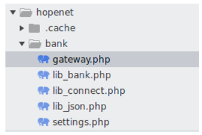
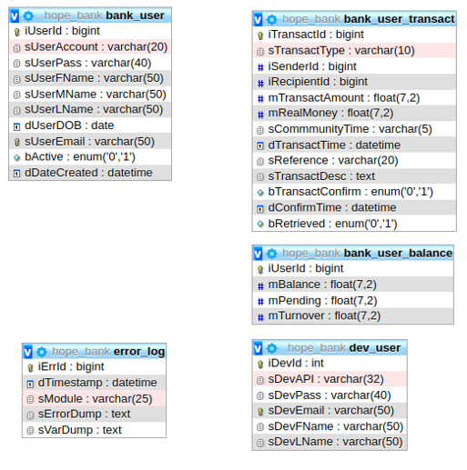

Author: Aaron Tolentino

Date: Nov 15, 2022

Version 0.0.1

# Description and Folder Structure

Banking is a way to store transactions that is used on claiming wGold
for Samaritan CItation site. It has its own isolated database for
transactions, users and dev users which are used for the connection
authentication.

Banking has its own module, meaning all requests are entirely API based.

It is located in the /bank folder on the root directory of the
application. There are 5 files inside it with the following description:

gateway.php

- The entrypoint of the banking request.

lib_bank.php

- Main class for banking and transactions

lib_connect.php

- Class for database connection

lib_json.php

- Class that Is used to convert JSON formatted response

settings.php

- A configuration file that is used to determine the database connection
  of samaritan citation and bank database.

- 

> 

# Configuration, Entrypoint and actions

The configuration file for the banking is located on the
**settings.php** under banking module. There are 3 configurations
defined on this file:

- Define a constant variable for the configuration of banking module and
  samaritan citation database.

- Include the lib_connect.php, lib_json.php, and lib_bank.php

- Setup the connection variable for banking database, and samaritan
  citation database that will be used on the entire app.

The entrypoint of the request is located on the gateway.php. All
requests for banking will be pointed to the gateway.php and will run the
**Execute** method from the **Bank** class located on **lib_bank.php.**

Only accepted actions are allowed to run:

- truecafelist

- userlist

- register

- retrieve

- community

- pay

- loanlist

- delete

- create

- send

- buy

- balance

- history

- loan

- loandebit

- truecafe

# Database Structure

Hope bank has its own database to isolate the data. Below are the tables
and descriptions:

bank_user

- This table defines all the bank accounts of the user. It is used for
  transacting wGold.

- It has the same exact table on the samaritan citation database which
  is bank_account.

bank_user_balance

- This table is used to store balance, pending and turnover wGold

bank_user_transact

- This table is used to store transactions or line items of the wGold
  transaction. It is also used to retrieve history.

dev_user

- It stores the credentials that are used to connect to the banking
  module API

error_log

- Error logging storage

See Entity Relations Diagram below:\

# Kindness integration

In order to have wGold, the user needs to be reported as a benefactor.
We are calling the banking API to create a bank account and insert wGold
for the benefactor after submitting the kindness report. See below the
integrations we call on this module:

1.  Creating a user

- This is defined on the **user_save** function of drupal located in the
  */modules/user/user.module* then calling the **user_module_invoke.**
  This function is calling the invoked function that is bank_user
  located in the */sites/all/modules/bank/bank.module* which calls the
  \_bank_post that will call the banking API.

2.  Adding wGold to the benefactor

- This is defined on the /sites/all/modules/kindness/kindness.module and
  search **\_add_gold** private method then calls the \_bank_post that
  will call the banking API.
